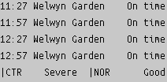

# Train & Tube Display

This project fetches train schedules and displays them on an InkyPHAT screen. It also provides the status of various tube lines.




## Features

- Fetches train schedules from `traintext.uk`.
- Displays the next few trains departing after a certain delay.
- Fetches the status of the `northern` and `central` tube lines from the TFL API.
- Displays the tube status on the InkyPHAT screen.
- Uses a rotating file handler to log messages.
- If there's an issue fetching the train data, a default image is displayed.

## Usage

1. Ensure you have all the dependencies installed.
2. Run the script:

```bash
python traintime.py
```

3. Add to cron `crontab -e` and schedule to run every minute

```crontab
* * * * * cd /home/pi/rpi_inky_uk_train_tfl_board && python traintime.py
```

Enjoy!
